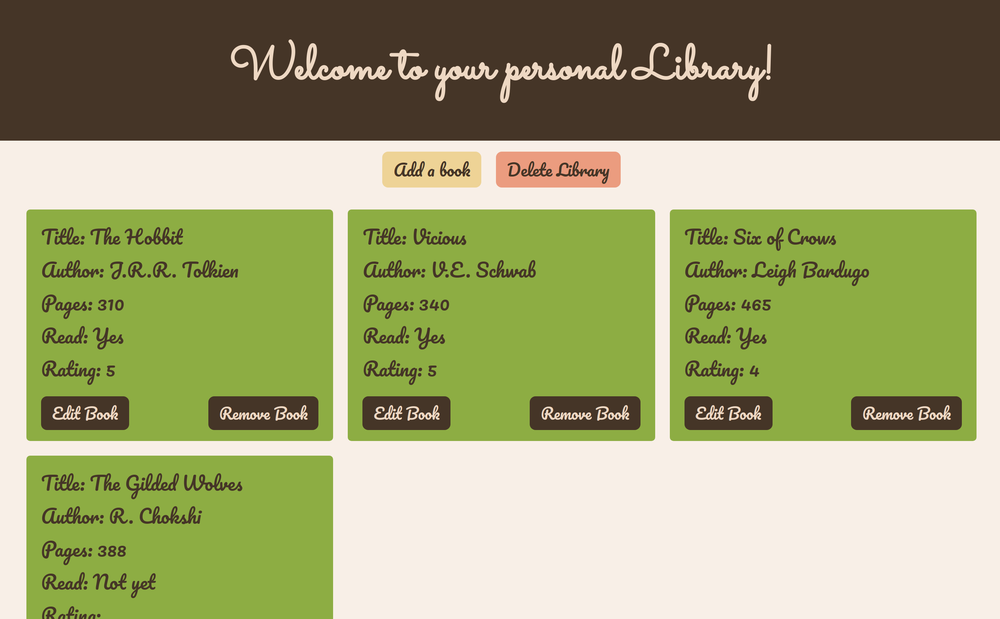

# Your personal Library

## Links

- [View Code](https://github.com/Bayoura/library)
- [Live Demo](https://bayoura.github.io/library/)

## Built with

- HTML
- CSS
- Grid
- Flexbox
- Vanilla JavaScript
- mobile first workflow

## I learned more about...

- JS objects and prototypes
- using child selectors
- using and building a submit form
- storing data (user input) in objects
- creating a modal
- using `transform` to center things (in combination with `position: fixed` and other things)
- `transition` effects
- the importance of pseudo code! It really helps a lot to really understand what you are trying to do and write that down first (instead of jumping straight into coding without a real plan) 

## Useful resources

- [Saving User Input in JS Objects](https://www.youtube.com/watch?v=NxVCq4p0Kb0) - Very nice explanation.

- [Build a Popup With JavaScript](https://www.youtube.com/watch?v=MBaw_6cPmAw) - This was incredibly helpful for building the modals and overlays.

## Author

- [codepen](https://codepen.io/bayoura)
- [GitHub](https://github.com/Bayoura)
- [Frontend Mentor](https://www.frontendmentor.io/profile/Bayoura)

